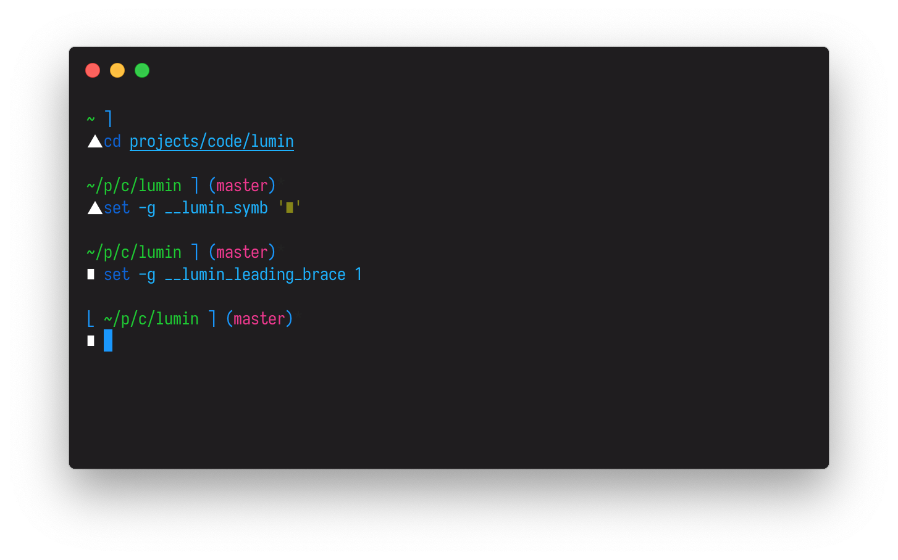

# lumin

> A simple and clean fish prompt.



## Installing

With [Fisher](https://github.com/jorgebucaran/fisher)

```
fisher add ovyerus/lumin
```

<details>
<summary>Without a package manager</summary>

Copy [`functions/fish_prompt.fish`](functions/fish_prompt.fish) to any directory on your function path.

```fish
curl https://git.io/JJ5gl --create-dirs -sLo ~/.config/fish/functions/fish_prompt.fish
```

</details>

## Options

lumin has a couple options to can set to slightly customise the theme.

#### `set -g __lumin_symb`

The icon the goes before your text input.  
Default: `▲`

#### `set -g __lumin_leading_brace`

Whether or not the prompt starts with with a brace or not.
Default: `0`
